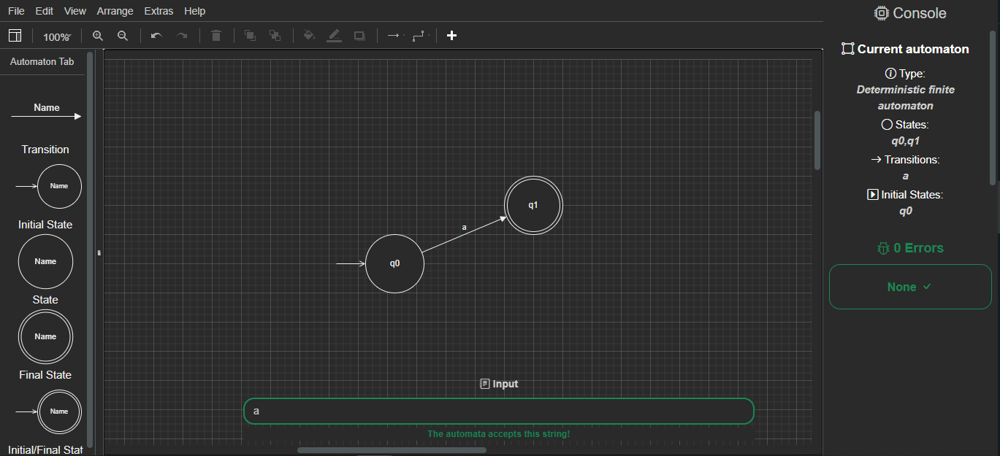
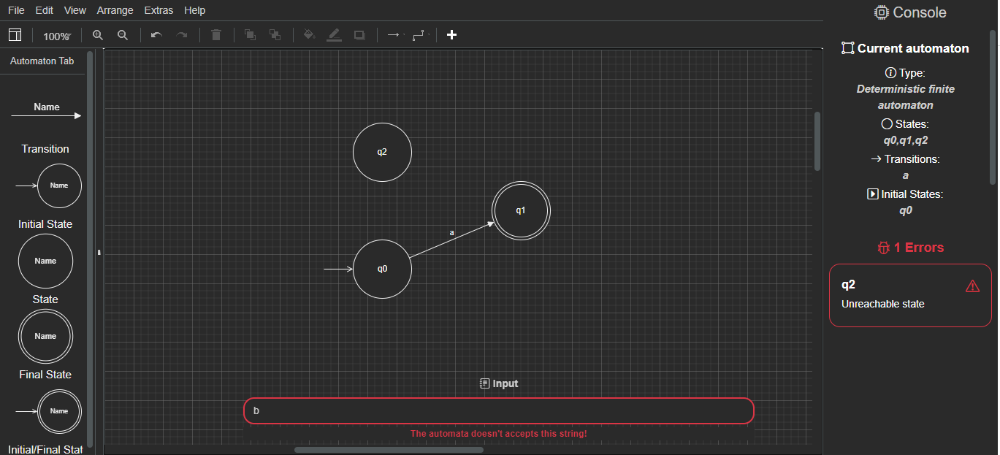

# Automata Graphic Editor
- This is a project developed for the DCC063-2021.1-A Formal Languages ​​and Automata course of the Federal University of Juiz de Fora, ministred by professor Ciro de Barros Barbosa.

- First, we aim to build a graph editor for deterministic finite and nondeterministic finite automatons that exports the automatons in XML/SVG. With a simple compiler to show the user some errors during the usage.

To use the project, download the files and open the <a href="https://github.com/Piazzi/automata-graphic-editor/blob/main/index.html"> index.html </a> file in your browser of choice. Or access our <a href="https://piazzi.github.io/automata-graphic-editor/"> Github Pages deploy </a>

To learn how to use the editor, please check out our <a href="https://github.com/Piazzi/automata-graphic-editor.wiki.git"> Wiki </a> .
